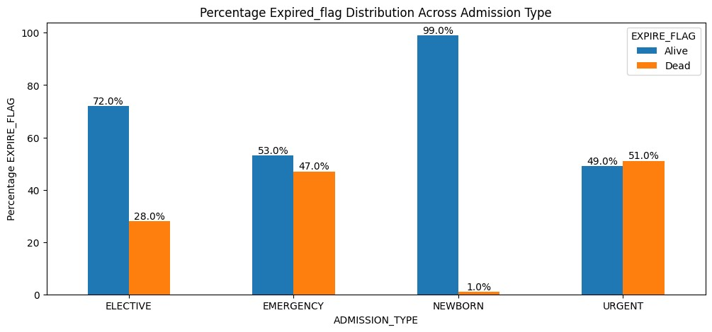
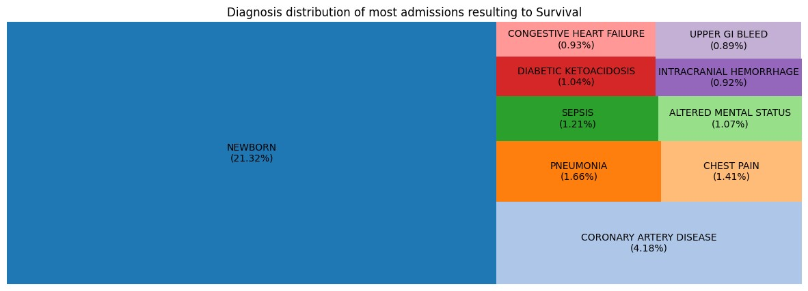
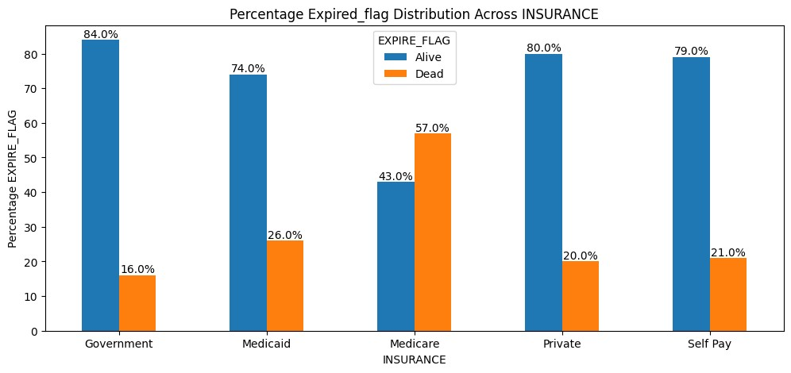

# Intensive-Care-Unit
Machine Learning Applications for Predicting NHS Patient Outcomes in Intensive Care Units Using Electronic Health Records (EHRs): Algorithms, Performance Metrics, and Clinical Implications

### Machine Learning for Predicting NHS ICU Patient Outcomes

This project focuses on using **machine learning (ML)** models to predict patient outcomes in NHS Intensive Care Units (ICUs) based on **Electronic Health Records (EHRs)**. 

#### Key Points:
- **Objective**: Predict ICU patient outcomes and explore the role of predictive modeling in improving patient care and resource allocation.
- **Algorithms Used**: Logistic Regression, Support Vector Machine (SVM), Random Forest, CatBoost, and Decision Trees  
- **Performance Metrics**:   Precision, Recall, F1-Score, and Area Under the Curve (AUC)  
- **Findings**:  
  - Predictive modeling demonstrates significant potential for improving clinical decision-making, optimizing healthcare efficiency, and allocating resources effectively.  
- **Implications**:  
  - Results support practical applications in healthcare for better decision-making and resource optimization.
This study underscores the importance of leveraging ML in healthcare settings for more informed and efficient outcomes.

### Demographic Data of Utilised Dataset
The ICU mortality distribution is imbalanced, with 60.69% of patients surviving and 39.31% not. Further analysis of factors driving the higher mortality rate is essential to improve outcomes and optimize healthcare resources.

### Distribution Of Dataset Across Various Characteristics

The mortality distribution by gender shows that 39% of female patients did not survive, compared to 37% of male patients. Female survival rates (61%) are lower than male survival rates (63%). Additionally, most ICU patients were male, with a majority surviving, while a higher proportion of female patients did not survive.

The mortality distribution by admission type shows survival rates of 72% for "Elective," 53% for "Emergency," 99% for "Newborn," and 49% for "Urgent" patients. Patients in the "Urgent" category have the lowest survival likelihood, while the "Newborn" category has the highest survival rate.

The tree map in Figure 4.7 shows the distribution of common diagnoses among surviving patients. The most frequent diagnosis is "Newborn" (21.23%), followed by "Coronary Artery Disease" (4.18%). Other notable diagnoses include "Pneumonia" (1.66%), "Sepsis" (1.21%), and "Chest Pain" (1.41%). "Newborn" is the most common diagnosis associated with survival.

The mortality distribution by insurance type shows survival rates of 84% for "Government," 74% for "Medicaid," 43% for "Medicare," 80% for "Private," and 79% for "Self-Pay." Patients in the "Medicare" category have the lowest survival rate, while other insurance types show higher survival rates.
