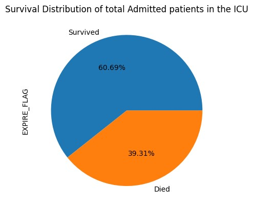
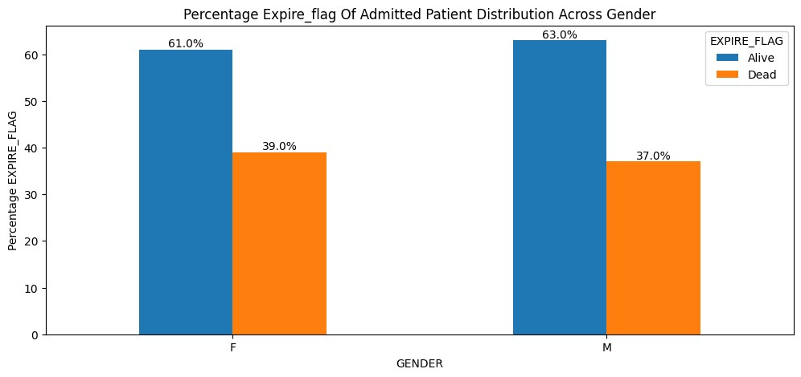

# Intensive-Care-Unit
Machine Learning Applications for Predicting NHS Patient Outcomes in Intensive Care Units Using Electronic Health Records (EHRs): Algorithms, Performance Metrics, and Clinical Implications

### Machine Learning for Predicting NHS ICU Patient Outcomes

This project focuses on using **machine learning (ML)** models to predict patient outcomes in NHS Intensive Care Units (ICUs) based on **Electronic Health Records (EHRs)**. 

#### Key Points:
- **Objective**: Predict ICU patient outcomes and explore the role of predictive modeling in improving patient care and resource allocation.
- **Algorithms Used**: Logistic Regression, Support Vector Machine (SVM), Random Forest, CatBoost, and Decision Trees  
- **Performance Metrics**:   Precision, Recall, F1-Score, and Area Under the Curve (AUC)  
- **Findings**:  
  - Predictive modeling demonstrates significant potential for improving clinical decision-making, optimizing healthcare efficiency, and allocating resources effectively.  
- **Implications**:  
  - Results support practical applications in healthcare for better decision-making and resource optimization.
This study underscores the importance of leveraging ML in healthcare settings for more informed and efficient outcomes.

### Demographic Data of Utilised Dataset
The ICU mortality distribution is imbalanced, with 60.69% of patients surviving and 39.31% not. Further analysis of factors driving the higher mortality rate is essential to improve outcomes and optimize healthcare resources.

### Distribution Of Dataset Across Various Characteristics

The mortality distribution by gender shows that 39% of female patients did not survive, compared to 37% of male patients. Female survival rates (61%) are lower than male survival rates (63%). Additionally, most ICU patients were male, with a majority surviving, while a higher proportion of female patients did not survive.
